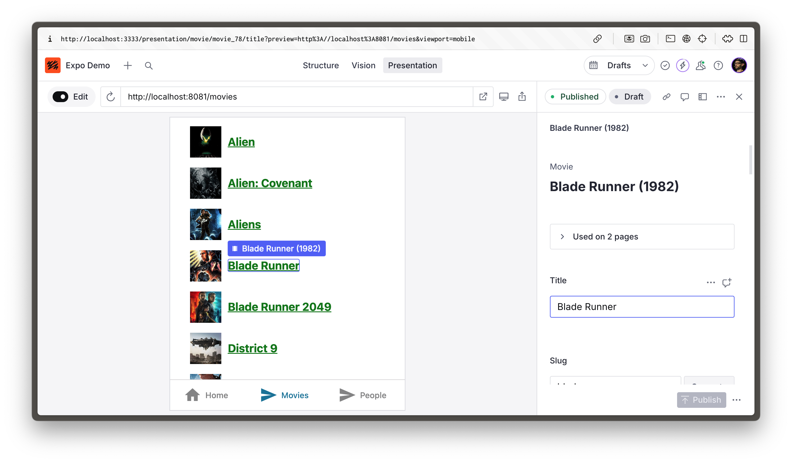

# Visual Editing for React Native on Expo



The project is a starting point for creating React Native apps on Expo with interactive live preview using Sanity Visual Editing.

For more information on the implementation in this repo, visit Sanity's ["Visual Editing with React Native" docs](https://sanity.io/docs/visual-editing/visual-editing-with-react-native).

- [Visual Editing for React Native on Expo](#visual-editing-for-react-native-on-expo)
  - [Pre-work: Setup a Sanity project (separate from this repository)](#pre-work-setup-a-sanity-project-separate-from-this-repository)
  - [Setup this Expo project](#setup-this-expo-project)
    - [Run the Sanity Studio and load the React Native app in Presentation:](#run-the-sanity-studio-and-load-the-react-native-app-in-presentation)
  - [Development](#development)
    - [Required Background Knowledge](#required-background-knowledge)
    - [Public vs Private Datasets](#public-vs-private-datasets)
    - [Querying private data outside Presentation mode](#querying-private-data-outside-presentation-mode)
    - [Live Content API (Presentation vs User-Facing Application)](#live-content-api-presentation-vs-user-facing-application)
  - [Deployment](#deployment)
    - [Shared Setup for Native and Web App builds (app.json)](#shared-setup-for-native-and-web-app-builds-appjson)
    - [Native/Simulator Builds](#nativesimulator-builds)
    - [Web Deployments](#web-deployments)
  - [Gotchas for this repo](#gotchas-for-this-repo)
    - [PNPM Install + Expo](#pnpm-install--expo)
    - [Content Security Policy (CSP)](#content-security-policy-csp)
  - [Other Notes](#other-notes)

## Pre-work: Setup a Sanity project (separate from this repository)

This content structure of this repository assumes that you have set up a Sanity project and studio and using the "Movies" starter template using the bootstrapping steps below.

1. In a separate directory from this repository, create a new Sanity project using the following command which will use the "Movies" template

```sh
npm create sanity@latest -- --template=moviedb
```

2.  When the init script asks "Add a sampling of sci-fi movies to your dataset on the hosted backend?" choose **yes**.

3.  Add a CORS origin for the Expo development server (`http://localhost:8081`) using the terminal

```sh
npx sanity cors add http://localhost:8081 --allow
```

or in [Sanity Manage](https://www.sanity.io/manage) which you can open with

```sh
npx sanity manage
```

1. Add a "location resolver" in your Sanity Studio to link documents to routes in your application

Create a `presentation/resolve.ts` file with the following content:

```typescript
// presentation/resolve.ts

import { defineLocations } from "sanity/presentation";

export const resolve = {
  locations: {
    // Match document types to route locations
    movie: defineLocations({
      select: {
        title: "title",
        slug: "slug.current",
      },
      resolve: (doc) => ({
        locations: [
          { title: "Movies Directory", href: "/movies" },
          { title: `Movie Page: ${doc?.title}`, href: `/movie/${doc?.slug}` },
        ],
      }),
    }),
    person: defineLocations({
      select: {
        name: "name",
        slug: "slug.current",
      },
      resolve: (doc) => ({
        locations: [
          { title: "People Directory", href: "/people" },
          { title: `Person Page: ${doc?.name}`, href: `/person/${doc?.slug}` },
        ],
      }),
    }),
  },
};
```

5. Configure the `presentationTool` plugin in your `sanity.config.ts` file to render the React Native app in the Sanity Studio

```typescript
// sanity.config.ts

// ...all other imports
import { presentationTool } from "sanity/presentation";
import { resolve } from "./presentation/resolve";

export default defineConfig({
  // ...all other config
  plugins: [
    // ...all other plugins
    presentationTool({
      resolve,
      previewUrl: {
        // 👇 Update this in production to to the URL of your Expo app
        origin: "http://localhost:8081",
      },
    }),
  ],
});
```

1. Run the Sanity Studio

```sh
pnpm run dev
```

## Setup this Expo project

> [!NOTE]  
> `pnpm` is recommended, development using other package managers has not been rigorously tested.

1. Create an [Expo project at `expo.dev`](https://expo.dev/) for the Expo web builds and add its Project ID to `app.json` (replace the existing project ID):

```json
"eas": {
   "projectId": "" <--- put your Expo project ID here!
}
```

2. Get your Sanity Project ID and Dataset configuration as environment variables with the following command:

```sh
npm create sanity@latest -- --env=.env.local
```

You should now have a `.env.local` file in the root of this project with the following variables:

```
# .env.local
SANITY_PROJECT_ID=<your-project-id>
SANITY_DATASET=<your-dataset>
```

Rename these values and add one for the URL of your Sanity Studio

```
# .env.local
EXPO_PUBLIC_SANITY_PROJECT_ID=<your-project-id>
EXPO_PUBLIC_SANITY_DATASET=<your-dataset>
EXPO_PUBLIC_SANITY_STUDIO_URL=http://localhost:3333
```

> [!NOTE]
> You will need to add these values to your Expo project's Environment Variables UI once deployed

3. Install dependencies

```sh
pnpm install
```

4. Run the expo project (clears the metro cache)

```sh
pnpm start
```

> [!NOTE]
> If you see an error warning in Cursor/VSCode in tsconfig.json about `expo/tsconfig.base` not existing, and you have already run the start command for the repo, sometimes you need to restart Cursor/VSCode (the IDE seems to have issues picking up the fact that expo starting up for the first time creates a .expo folder and clears that type error).

The Expo app will now be running and can be opened in the browser (project default host is `http://localhost:8081`) or in the iOS simulator (see the console in the terminal window that is running Expo for instructions on the different options/features enabled by Expo Go).

### Run the Sanity Studio and load the React Native app in Presentation:

Now that you have both the Sanity Studio and the Expo app running, you can load the Expo app in Presentation mode by clicking the "Presentation" tab in the Sanity Studio or visit [http://localhost:3333/presentation](http://localhost:3333/presentation)

🎉 You should now be able to browse lists of movies and people, with click-to-edit functionality on any content that came from your Sanity dataset.

## Development

You can start developing by editing the files inside the **app** directory. This project uses [file-based routing](https://docs.expo.dev/router/introduction).

### Required Background Knowledge

You will almost certainly want to edit the home screen contents, remove the movies/people pages/components, and add your own pages/components, but you'll need to understand how to use several key features before modifying/removing any code. These features are:

- `useQuery`: This hook is required in order to load data from Sanity (which is automatically kept up to date when in Presentation mode -- under the hood the `useLiveMode` hook takes over, but your components should just need `useQuery` because `useLiveMode` is already configured at the app root inside the `SanityVisualEditing` component).
- `dataSet`: This prop for React Native scalar components (`Image`, `Text`, `View`, etc) is optional, used to enable Visual Editing features for non-text elements. Text elements (strings, rich text, etc) already have click-to-edit enabled by default (because of the `stega` option on our Sanity client). If you want to enable overlays for non-text elements, drag-and-drop for sortable arrays of content blocks, etc, you need to pass `{ sanity: attr }` where the `attr` is a sanity data attribute created using `createDataAttributeWebOnly` from [/utils/preview](/utils/preview.ts).

**To understand how to use both of these features in your own pages/components:**

- Check out the [/app/(tabs)/movies.tsx](</app/(tabs)/movies.tsx>) file (uses `useQuery` for data and `dataSet` to enable click-to-edit poster images) and the [/app/movie/[movie_slug].tsx](/app/movie/[movie_slug].tsx) file (uses `useQuery` for data fetching and `dataSet` to enable drag-and-drop cast members list).
- read Sanity's ["Visual Editing with React Native" docs](https://sanity.io/docs/visual-editing/visual-editing-with-react-native).

### Public vs Private Datasets

NOTE the `useQuery` hook from `@sanity/react-loader` does not currently support a "token" parameter, so it does not currently support querying a **private dataset** when you are NOT in Presentation mode in the Sanity Studio.

When you ARE in Presentation mode in the Sanity Studio, the `useLiveMode` hook takes over from `useQuery` for data fetching.

That `useLiveMode` hook fetches data using a session cookie (set by the Presentation Plugin) to make queries that can include private data and draft content (for live editing updates).

The `useLiveMode` hook respects the user's role when determining which data/content types that user can access in Presentation mode (including Custom Roles).

### Querying private data outside Presentation mode

Create a private querying hook (call it `usePrivateQuery` or `useSanityQuery` or whatever you prefer) that allows you to perform token-authorized queries. However, NEVER add that token to the client side bundle/environment, since **IT IS AN API KEY**. Some example approaches for how to perform secure queries to private datasets in your private querying hook:

1. Build an API that has custom auth (for however you authenticate your users) and returns a token for the Sanity client to use in calls to client.fetch (this is the simplest approach but has the negative side effect that it exposes the token to the client side, so any logged in user can take that token and take ANY action for which the token is authorized -- usually at a minimum this means making ANY query to your data, but can also even include writing data, updating settings, etc depending on the token).
2. Have a proxy API that has custom auth and can make queries on your behalf FROM the server, which never exposes the token to client side users. (this allows you to either allow arbitrary queries if all authorized users should be able to make any query OR even allows you to lock down which queries can be made by exposing API routes for individual queries).

Once you have defined that private querying hook, decide conditionally at runtime whether to call the Sanity React Loader's `useQuery` or your own `usePrivateQuery` (or whatever you've named it), depending on whether you are in Presentation mode in the weg context. Determining whether you are in Presentation mode can be done with a helper from `@sanity/presentation-comlink` called `isMaybePresentation` and the web context can be checked using the `isWeb` util from this repo.

So an example conditional usage of the correct hook for the platform/context might be like:

```typescript
const { isMaybePresentation } = import "@sanity/presentation-comlink"
const usePrivateQuery = import "@/hooks/usePrivateQuery"
const { isWeb } = import '@/utils/preview";

<!-- In a real life example, put this "createQueryStore" call in its own module so that it is called ONLY once and imported into components where used -->

const { useLiveMode, useQuery} = createQueryStore({ client, ssr:false })

function SomeComponent {
  const { data } = isWeb && isMaybePresentation() ? useQuery(query) : usePrivateQuery()

  return <div>...contents</div>
}
```

### Live Content API (Presentation vs User-Facing Application)

**In Presentation Mode**

When you ARE in Presentation mode, `useLiveMode` as implemented above will use the Sanity Live Content API to show you the latest content for whatever "Perspective" you choose in the Presentation UI itself. The most common Perspective used is "Drafts", because that will show you all edits to documents, live in real time, but you can also choose "Published", custom perspectives if they are enabled for your studio, etc.

**In User-Facing Application**

When you are NOT in Presentation mode, to use the Live Content API, you must implement a connection mechanism for it in your project. A package is WIP for an out-of-the-box Live Content API connector for vanilla React and React Native and will be added to this example when available.

For example/starting point implementations in the meantime, check the [`lcapi-examples` Github Repo](https://github.com/sanity-io/lcapi-examples/tree/main).

Learn more about the [Live Content API here](https://www.sanity.io/docs/live-content-api).

## Deployment

This repo uses the Expo build servers to generate builds of your React Native app (web, simulator, device) and uses EAS Hosting to host the web build (for loading in Presentation).

Deploy your Expo app to EAS Hosting with:

```sh
pnpm deploy:web:staging
```
OR
```
pnpm deploy:web:prod
```
depending on the desired EAS Hosting configuration (the prod script deploys with the `--prod` flag).


You will get a URL for the deployed app, which you will need to update in the `previewUrl` in your `sanity.config.ts` file (and then redeploy the sanity studio).

```ts
// sanity.config.ts

// 👇 Update your imports from sanity
import { defineConfig, isDev } from "sanity";

// 👇 Update this line in the presentationTool plugin
// origin: isDev ? 'http://localhost:8081' : 'https://<your-expo-app-url>.expo.app',
```

Then deploy your Sanity Studio from the command line with:

```sh
npx sanity deploy
```

You should now be able to visit your Sanity Studio in production, and view the deployed React Native app in Presentation.

### Shared Setup for Native and Web App builds (app.json)

Make sure to change the `projectId` in `app.json` to your own project's ID.

### Native/Simulator Builds

Make sure you have an Expo project in the Expo dashboard with your environment variables defined (see above)

Follow Expo's guides building for iOS simulator, iOS, Android, etc and chosen environment (development, preview, production, etc), depending on your use case. (This project was built successfully as a preview build for iOS simulator, so it should work for at least that use case).

### Web Deployments

In this codebase, I've set the project up to deploy the web build of the Expo app to Expo Application Services with:

```
pnpm deploy:web:staging
```
and 
```
pnpm deploy:web:prod
```

Add all deployment and local development URLs for this project to the Sanity project's CORS origins. Any host that wants to query your data in Sanity has to be configured in those project CORS settings (set Allow Credentials to true). Use the [Sanity Manage](https://sanity.io/manage) console to update CORS settings.

## Gotchas for this repo

### PNPM Install + Expo

Occasionally on a clean install, `pnpm install` does not seem to install all of Expo's dependencies (sometimes the error is shown at install and sometimes at runtime). Remove `node_modules` and `pnpm-lock.yaml`, clear the pnpm cache (`pnpm cache delete`), and re-run `pnpm install`.

> [!NOTE]
> By removing the lockfile you may advance your dependency versions, so be prepared for those changes (or roll back to a previous version of the lockfile and remove/reinstall the node_modules).

### Content Security Policy (CSP)

You are not required to use EAS Hosting but depending on the service you choose, you may be required to customize the Content Security Policy header used by the web app in order for the Presentation tool to load it in an iframe inside the Sanity Studio.
Before choosing a hosting service, verify that either
1) that provider does not constrain loading deployed web apps in an iframe on a different hostname
OR
2. that provider allows customization of the CSP header

If neither of these are the case, you would deploy, try to open the Presentation tool, and get a Content Security Policy error message in the browser devtools.

Should you need to configure it, a valid example CSP header is:

```
"frame-ancestors 'self' http://localhost:8081 https://www.sanity.io <INSERT WEB BUILD DEPLOYED URL HERE> <INSERT DEPLOYED SANITY STUDIO URL HERE>"
```

In this example, the URLs (in order) are for:

- a development environment for the React Native app
- sanity.io's Dashboard (a centralized "content operating system" web application where deployed Studios and Sanity SDK applications are "installed" in a single organization-level view. [Learn more about Dashboard](https://www.sanity.io/docs/dashboard).)
- the deployed web build of your React Native app 
- the deployed instance of your Sanity Studio.

## Other Notes

Several standard modules from Node that are part of the @sanity library but are not in the React Native runtime are shimmed using metro.config.js. Run the expo start command above with the `--clear` flag to clear the metro cache if you make additions/modifications to those shims for your own use case.
